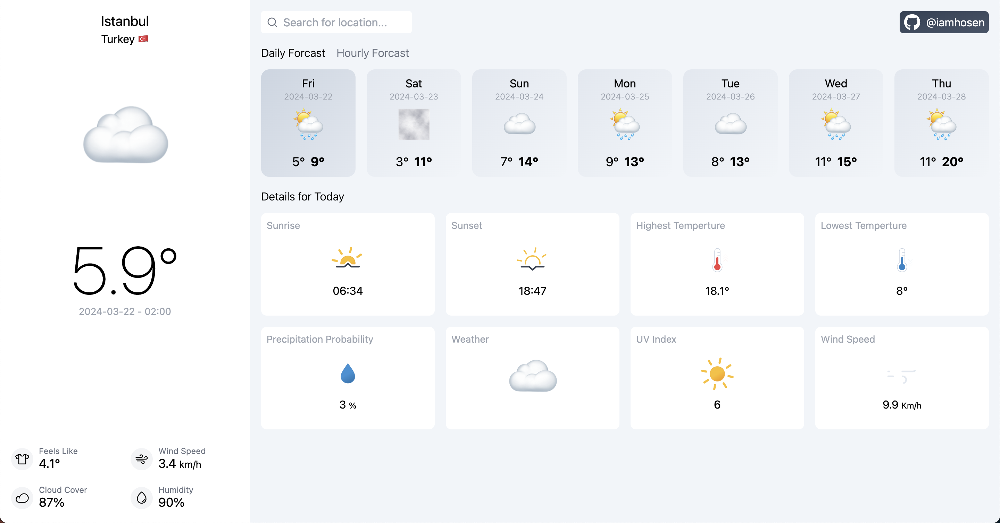

# React Weather App

This repository contains a simple Weather App built using React.js with Class-based Components.

## Screenshots



## Features

- View current weather conditions based on user location or search
- Display weather condition icon
- Responsive design
- Hourly and Daily forcast
- Forcast in details

## Installation

1. Clone the repository:

   ```bash
   git clone https://github.com/iamhosen/weather-app-react-legacy.git

2. Navigate to the project directory:
   
   ```bash
   cd weather-app-react-legacy

3. Install dependencies

    ```bash
    npm install


4. Start the development server
   
    ```bash
    npm run dev

5. Open your browser and visit http://localhost:5173/ to view the app.


## Technologies Used

- React.js
- Tailwind Css
- Open-Meteo API

## Credits

This Weather App is developed by Hossein Amirhosseini.

## License

This project is licensed under the [MIT License](LICENSE).